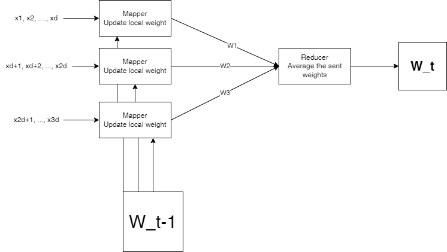

# Big-Data-and-Analytics
- **Dataset Used** : [Rain in Australia](https://www.kaggle.com/datasets/jsphyg/weather-dataset-rattle-package)
- **Models Used** : Logistic Regression, KNN
- **Problem** : Predict next-day rain by training classification models on the target variable RainTomorrow (binary) using dataset gathered on 10 years of daily weather observations from many locations across Australia. 


## Data pre-processing
Refer to `preprocessing.ipynb` for information on perprocessing and visualization.

 ## Logistic Regression Model
 ### Paper: http://www.cs.cmu.edu/~wcohen/10-605/notes/sgd-notes.pdf
 ### Idea
- Initialize model
- Run multiple epochs of SGD on each mapper locally to update local weights, considering :
    - A decreasing learning rate w.r.t time (`lrate = ETA / (t*t)`)
    - Regularization by penalizing previous weights with a factor of `MU` and `lrate`

    $$
    W(t+1) = W(t) (1 - 2\lambda\mu) + \lambda(y - p)X
    $$
- The reducer gathers and averages all local weights of mappers  



 ### Hyper-parameters (refer to the paper)
 - `ETA` (env): This is the constant factor in the learning rate, the learning rate is calculates as `ETA / t*t`
 - `MU` (env): Penality applied on previous weight for regularization
 - `T` (constants.py): Number of epochs

 ### Training
 To run training on Hadoop, follow these steps:
- Make sure that hadoop is installed, Run `jps` and make sure this is - at least - the output:

```
10737 NodeManager
15667 Jps
10467 ResourceManager
10230 SecondaryNameNode
9990 DataNode
9767 NameNode
```

> Note: Process IDs (numbers to the right) will be different

- Copy `hadoop-streaming-3.3.0.jar` to your `$HADOOP_HOME`
- Give execute permissions to the following files: `train_mapper.py`, `train_reducer.py`, `logreg.sh`
- Export `ETA` and `MU` environment variables :
    
        $ export ETA=0.01
        $ export MU=0.0001 

- Run `./logreg.sh train`
- Now your output model is stored in `/Project/Output/part-00000` in hdfs. Run `./logreg.sh import` to copy weights to `model.txt`

### Validation and Parameter Tuning
- After training, you now have model weights stored in `model.txt`. All you need to do is to run `python perf.py`. It'll try the model against `validate.csv` records and output the performance.

        $ python perf.py validate.csv

- You can use `tuning.py` to tune ETA and MU parameters using `validate.csv`
> Note: `tuning.py` is not optimized so it may take so long time depending on how fast is hadoop on your machine

### Test
- If you have a test set `test.csv` (including labels), run the following to get the performance of your model

        $ python perf /path/to/test.csv


### Results
- Using 2 Mappers
- Using 1 Reducer
- ETA=0.01
- MU=0.0001
- T=1000
- Initial Model = [1.000, 1.000, ..., 1.000]
- Training Performance = 79.035%
- Validation Performance = 79.03%

---
## KNN
